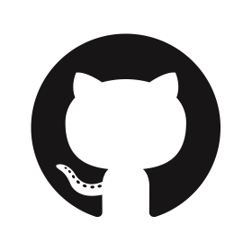

 

# Posh-GitHub

Unofficial Powershell cmdlets that expose the GitHub API

## Early Code

This is a super super early take on some rudimentary GitHub functionality.
I will continue to improve this over time as need grows / time allows.  There
may be bugs or things I haven't thought of -- please report if that's the case!

## Compatibility

* This is written for Powershell v3 and makes use of the simplified
[Invoke-RestMethod][invoke-rest] instead of the `WebClient` class.
  * Powershell v3 can be installed with [Chocolatey][Choc] via `cinst powershell`

* This is written against GitHub API v3

[invoke-rest]: http://technet.microsoft.com/en-us/library/hh849971.aspx
[Choc]: http://www.chocolatey.org

## Installation

### Chocolatey

Once Chocolatey has been installed, simply use the `cinst` command.

```powershell
cinst posh-github
```

Chocolatey installation will import the module into your PowerShell profile.

## Updating

### Chocolatey

After installing with Chocolatey, simply use the `cup` command.

```powershell
cup posh-github
```

## Supported Commands

### Environment Variables

Cmdlets are set to use the following environment variables as defaults

* `GITHUB_OAUTH_TOKEN` - Required for all cmdlets - use `New-GitHubOAuthToken`
  to establish a token and automatically set this variable for the current user
* `GITHUB_USERNAME` - Can be optionally set to specify a global default user -
use the `Set-GitHubUserName` helper
* `GITHUB_ORGANIZATION` - Can be optionally set to specify a global default
organization - use the `Set-GitHubOrganization` helper

### Last Command Output

A Powershell object created from the incoming JSON is always stored
in the variable `$GITHUB_API_OUTPUT` after each call to the GitHub API

### New-GitHubOAuthToken

Used to create a new OAuth token for use with the GitHub using your
username/password in basic auth over HTTPS.  The result is stashed in the
`GITHUB_OAUTH_TOKEN` environment variable.

```powershell
New-GitHubOAuthToken -UserName Bob -Password bobpassword
```

```powershell
New-GitHubOAuthToken -UserName Bob -Password bobpassword -NoEnvironmentVariable
```

### Get-GitHubOAuthTokens

Used to list all the authorizations you have provided to applications / tooling

```powershell
Get-GitHubOAuthTokens Bob bobspass
```

### Set-GitHubUserName

Adds the username to the current Powershell session and sets a global User
environment variable

```powershell
Set-GitHubUserName Iristyle
```

### Set-GitHubOrganization

Adds the organization to the current Powershell session and sets a global User
environment variable

```powershell
Set-GitHubOrganization EastPoint
```

### Get-GitHubRepositories

List all your repositories - gives a fork indicator, a date for when the last
update (push) occurred, how many open issues and size

```powershell
Get-GitHubRepositories
```

```powershell
Get-GitHubRepositories -Type owner -Sort pushed
```

### New-GitHubRepository

Creates a new GitHub repository and clones it locally by default.

By default creates a public repository for the user configured by
`GITHUB_USERNAME`, and clones it afterwards.

```powershell
New-GitHubRepository MyNewRepository
```

If you are a member of an organization and have set a `GITHUB_ORG` environment
variable, this will create the repository under that organization.  Note that
organization repositories require a TeamId

```powershell
New-GitHubRepository MyNewOrgRepo -ForOrganization -TeamId 1234
```

If you are a member of multiple organizations you may override the default
configured organization

```powershell
New-GitHubRepository MyNewOrgRepo -Organization DifferentOrg -TeamId 1234
```

A fancier set of switches -- pretty self-explanatory.
The complete [Gitignore list][gitignore] here is at your disposal.

```powershell
New-GitHubRepository RepoName -Description 'A New Repo' `
  -Homepage 'https://www.foo.com' -Private -NoIssues -NoWiki -NoDownloads `
  -AutoInit -GitIgnoreTemplate 'CSharp' -NoClone
```

[gitignore]: https://github.com/github/gitignore

### New-GitHubFork

Forks a repository, clones it locally, then properly adds a remote named
`upstream` to point back to the parent repository.  Aborts if there is a
directory in the current working directory that shares the name of the
repository.

Uses the environment variable `GITHUB_OAUTH_TOKEN` to properly fork to your
account.  After forking, clones the original source, resets origin to the new
url for your account `https://github.com/YOURUSERNAME/Posh-GitHub.git`,
and sets the upstream remote to `https://github.com/Iristyle/Posh-GitHub.git`

```powershell
New-GitHubFork Iristyle 'Posh-GitHub'
```

Performs the same operation as above, instead forking to the default
organization specified by the `GITHUB_ORG` environment variable.

```powershell
New-GitHubFork Iristyle 'Posh-GitHub' -ForOrganization
```

Performs the same operation as above, instead forking to a user specified
organization specified by the `-Organization` switch.

```powershell
New-GitHubFork Iristyle 'Posh-GitHub' -Organization MySecondOrganization
```

Forks the repository, without calling `git clone` after the fork.

```powershell
New-GitHubFork -Owner Iristyle -Repository 'Posh-GitHub' -NoClone
```

### Get-GitHubIssues

List issues against the repository for the current working directory,
or can list issues against a specific repo and owner.

Simply list issues for the current working directory repository.  Checks first
for an `upstream` remote and falls back to `origin`

If the current directory is not a repository, then lists all the issues assigned
to you, assuming the `GITHUB_OAUTH_TOKEN` has been set properly.

```powershell
Get-GitHubIssues
```

To get your issues regardless of whether or not the current directory is a Git
repository.

```powershell
Get-GitHubIssues -ForUser
```

Same as above, but finds up to the last 30 closed issues.

```powershell
Get-GitHubIssues -State closed
```

All parameters possible when searching for user issues

```powershell
Get-GitHubIssues -ForUser -State open -Filter created -Sort comments `
  -Direction asc -Labels 'ui','sql' -Since 8/31/2012
```

Must be ordered by Owner, Repo if not using switches on params

```powershell
Get-GitHubIssues EastPoint Burden
```

Switch on params form

```powershell
Get-GitHubIssues -Owner EastPoint -Repository Burden
```

Closed issues

```powershell
Get-GitHubIssues -Owner EastPoint -Repository Burden -State closed
```

Supplying all parameters for a repository based issue search

```powershell
Get-GitHubIssues -Owner EastPoint -Repository Burden -State closed `
  -Milestone '*' -Assignee 'none' -Creator 'Iristyle' -Mentioned 'Iristyle'
  -Labels 'ui','sql' -Sort updated -Direction desc -Since 8/31/2012
```

### New-GitHubPullRequest

Initiates a new pull request to the `upstream` repo.

If you follow the convention of setting a remote named upstream, and you create
new branches for new work, then this cmdlet should work mostly automatically
to find the appropriate owner and repo to send the pull request to, and it will
base it on the origin username and current branch name.

Supports a title and body.

```powershell
New-GitHubPullRequest -Title 'Fixed some stuff' -Body 'More detail'
```

Support an issue id.

```powershell
New-GitHubPullRequest -Issue 5
```

Supports a branch other than master to send the pull to.

```powershell
New-GitHubPullRequest -Issue 10 -Base 'devel'
```

If you don't have a remote set, then override the default sniffing behavior.

```powershell
New-GitHubPullRequest -Issue 10 -Owner EastPoint -Repository Burden
```

If you're not on the current branch you want to send the pull for, override it.

```powershell
New-GitHubPullRequest -Title 'fixes' -Head 'myusername:somebranch'
```

Note that GitHub generally requires that head be prefixed with `username:`

### Get-GitHubPullRequests

List pull requests against the repository for the current working directory,
or can list pull requests against all forks from a user.

Inside of a Git repository, this will look first for a remote named `upstream`
before falling back to `origin`.

Inside of a non-Git directory, this will list pulls for all of your forks,
assuming you have set the `GITHUB_USERNAME` environment variable

```powershell
Get-GitHubPullRequests
```

When inside of a Git directory, the repo lookup behavior may be overridden
with the `-ForUser` switch, assuming `GITHUB_USERNAME` has been set

```powershell
Get-GitHubPullRequests -ForUser
```

Will list all open pull requests the 'Posh-GitHub' repository

```powershell
Get-GitHubPullRequests -Owner EastPoint -Repository 'Posh-GitHub'
```

Lists all open __public__ pull requests against the given users forks, overriding
the `GITHUB_USERNAME` default user.

```powershell
Get-GitHubPullRequests -User Iristyle
```

Will list all closed pull requests against the 'Posh-GitHub' repository

```powershell
Get-GitHubPullRequests -Owner EastPoint -Repository 'Posh-Github' -State closed
```

### Get-GitHubTeams

The default parameterless version will use the `GITHUB_ORG` environment variable
to get the list of teams, their ids and members.

```powershell
Get-GitHubTeams
```

This will find all the teams for the EastPoint organization.  You must have
access to the given organization to list its teams.

```powershell
Get-GitHubTeams EastPoint
```

### Get-GitHubEvents

Will list, in chronological order, the last 30 events that you have generated

```powershell
Get-GitHubEvents
```

Will list the public events for another user

```powershell
Get-GitHubEvents -User Iristyle
```

### Backup-GitHubRepositories

This will clone every repository for the specified user or organization, and will
additionally clone each fork, as determined by open pull requests.  Does not backup
issues or wiki (yet).

The default parameterless version will use the `GITHUB_USERNAME` environment variable
to get the list of repos where the user is an owner or a member, and will backup each
one locally to disk

```powershell
Backup-GitHubRepositories
```

This will find all the public repos for the github organization, and will clone each one
locally

```powershell
Backup-GitHubRepositories -Organization github
```


## Additional Git helper commands

These commands do not use GitHub service, but are common enough for inclusion.

### Clear-GitMergedBranches

Will remove any local branch cruft from branches that have been merged into
the master branch.

```powershell
Clear-GitMergedBranches
```

When pull requests have been merged, it's typical to delete the branch after
accepting.  Remotes may no longer have branch names for things that have been
merged.  This command removes remote branch names that no longer exist.

```powershell
Clear-GitMergedBranches -Remote
```

## Roadmap

None really.. just waiting to see what I might need.

